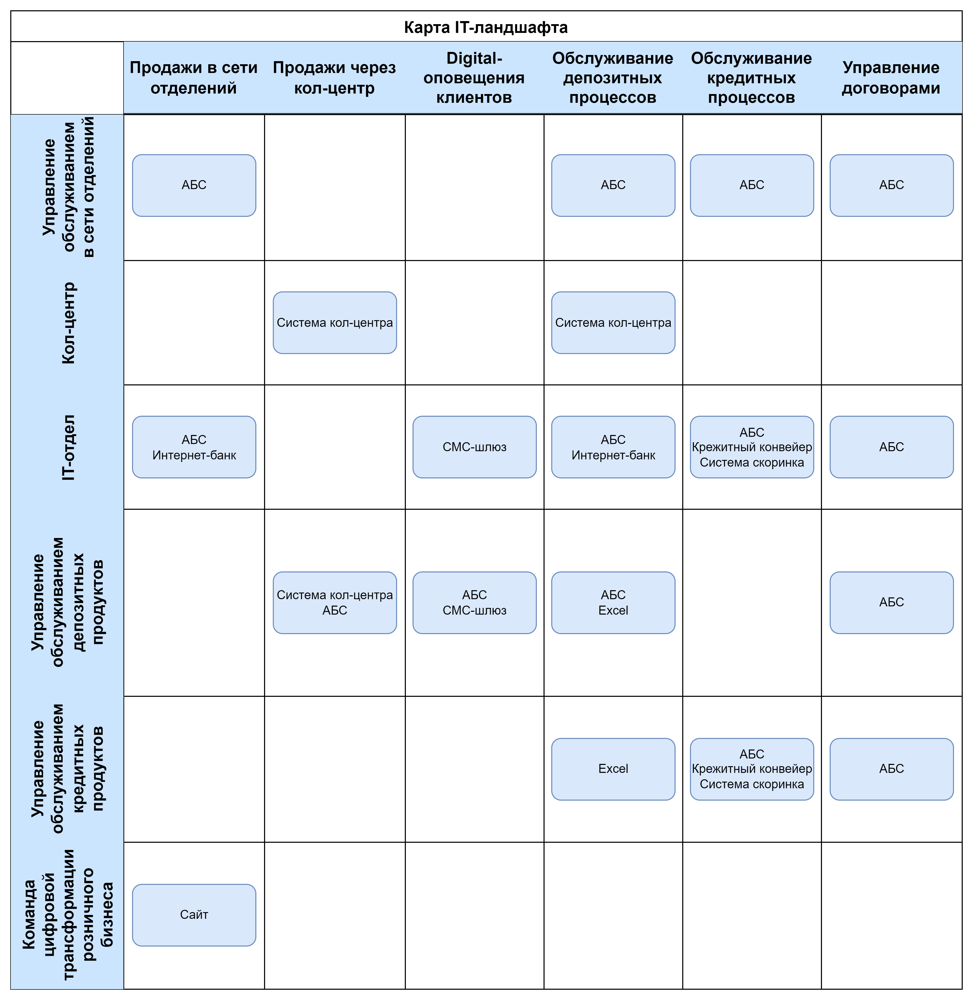
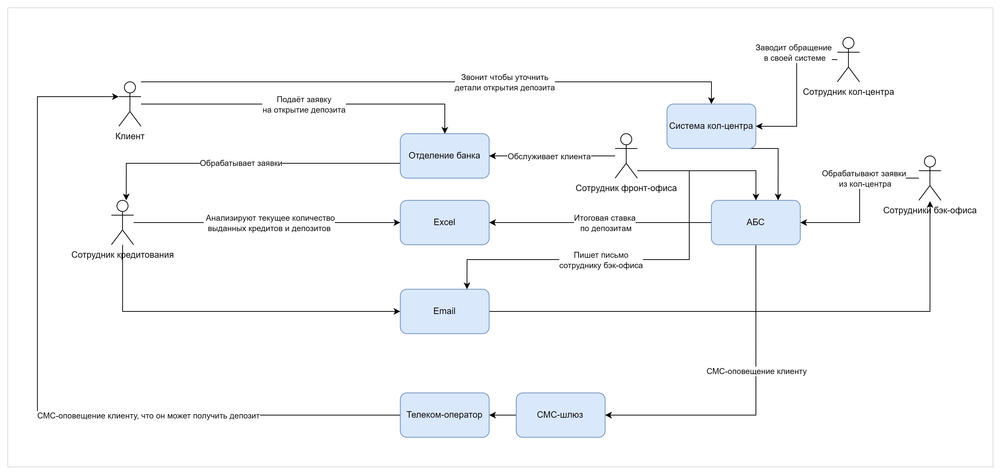

### Карту текущего IT-ландшафта

Ссылка на drawio:
[drawio](it_landscape.drawio)

## 1. Карта текущего IT-ландшафта – содержит элементы организационной структуры в строках и бизнес-возможности второго уровня в колонках.

## 2. Схема интеграции приложений – показывает взаимодействие участников процессов.

