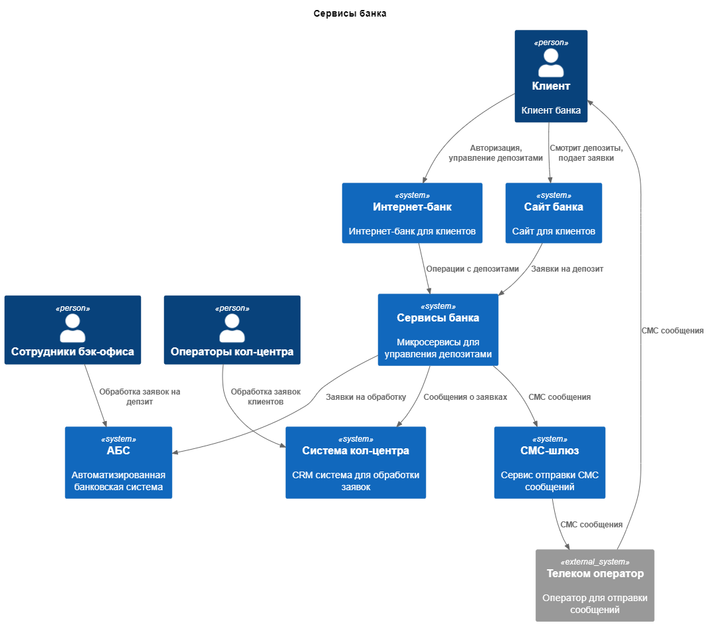
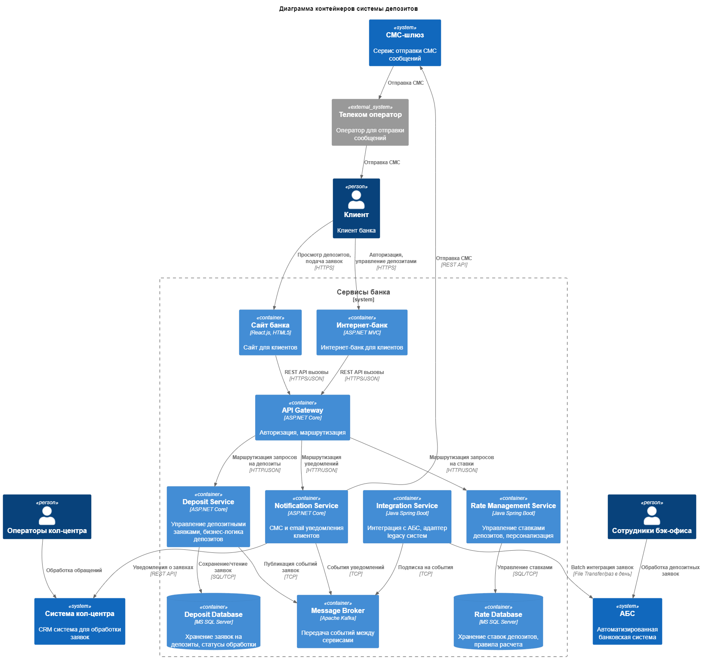

### **Название задачи:** Открытие депозитов
### **Автор:** Петров Е.В.
### **Дата:** 09.07.2025
### **Функциональные требования**
Опишите здесь верхнеуровневые Use Cases. Их нужно оформить в виде таблицы с пошаговым описанием:

|**№**|**Действующие лица или системы**|**Use Case**|**Описание**|
| :-: | :- | :- | :- |
|1|Клиент, Сайт, Система кол-центра, Менеджер|Подача заявки на депозит через сайт|1. Клиент смотрит список депозитов с актуальными ставками на сайте 2. Заполняет заявку на выбранный депозит (ФИО, номер телефона) 3. Система сохраняет заявку 4. Менеджер видит заявку 5. Менеджер изучив заявку звонит клиенту и предлагает условия 6. Клиент приходит в отделение для идентификации|
|2|Клиент, Интернет-банк, АБС, Сотрудник бэк-офиса, СМС-шлюз|Подача заявки на депозит через интернет-банк|1. Клиент авторизуется в интернет-банке 2. Смотрит депозиты с актуальными и персонализированными ставками 3. Указав счёт и сумму депозита, подает заявку на открытие депозита 4. Подтверждает операцию с помощью СМС-кода 5. Система сохраняет заявку 6. Сотрудник бэк-офиса видит заявку в АБС 7. Клиент получает СМС-уведомление о статусе заявки|
|3|Сотрудник бэк-офиса, АБС, СМС-шлюз|Обработка заявки на депозит|1. Сотрудник видит заявку в АБС 2. Проверяет данные клиента и условия депозита 3. Подтверждает или отклоняет заявку 4. При одобрении открывает депозит в АБС 5. Система отправляет СМС-уведомление клиенту|
### **Нефункциональные требования**
Опишите здесь нефункциональные требования и архитектурно значимые требования.

|**№**|**Требование**|
| :-: | :- |
|1|Время отклика пользовательского интерфейса < 100 мс|
|2|Доступность сервисов SLA 99,9% (24/7)|
|3|Поддержка до 1000 одновременных пользователей|
|4|Обязательное шифрование трафика (HTTPS/TLS)|
|5|Отказ от прямых интеграций с АБС API|
|6|Использование текущего стека технологий (MS SQL, Oracle)|
|7|Микросервисная архитектура для депозитного функционала|
|8|Горизонтального масштабирования сервисов|
|9|Собирать логи для всех операций в системе|
|10|Автоматическое резервное копирование данных|
|11|Изоляция новых сервисов от критичных систем|
|12|Соответствие корпоративной системе дизайна|

### **Решение**
Приведите диаграммы контекста и контейнеров в модели C4. Опишите там основные компоненты и интеграции всех элементов решения. 

Также опишите, какой логикой вы руководствовались в ходе принятия решений и выбора технологий. Не забывайте, что необходимо учесть все функциональные и нефункциональные требования.

Apache Kafka
- Разгрузить перегруженную систему АБС
- Удобное горизонтальное маштабирование сервисов
- Микросервисная архитектура
- Изоляция старых систем

API Gateway
- Сосушествование новых и старых элементов системы
- Обший мониторинг действий пользователя
- Вынесение общей логики авторизации

Для более быстрой адаптации комманды используется стек технологий из старых элементов системы MS SQL, Oracle

### **Альтернативы**
Опишите здесь наиболее важные альтернативные решения.

Использовать REST API вместо Брокера сообщений для передачи заявок а нагрузку снизить кешированием. 

Kafka добавляет сложность, а REST API проще для команды. Можно снизить нагрузку на АБС за счёт кеширования.

Плюсы:
- REST API самый распространенный стандарт
- Наличие опыта использование командой
- Проще в поддержке

Минусы:
- Сложнее горизонтально маштабировать
- Возможна перегрузка системы и последовательный отказ сервисов

**Недостатки, ограничения, риски**

Подробно опишите здесь недостатки, ограничения и риски выбранного решения.

- Дополнительных инвестиций в инфраструктуру из за микросервисной архитектуры
- Дополнительные ресурсы для поддержки
- Увеличатся временные затраты на разработку изза нового стека технологий

