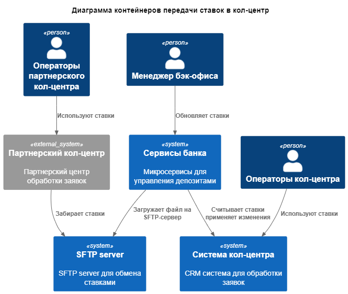
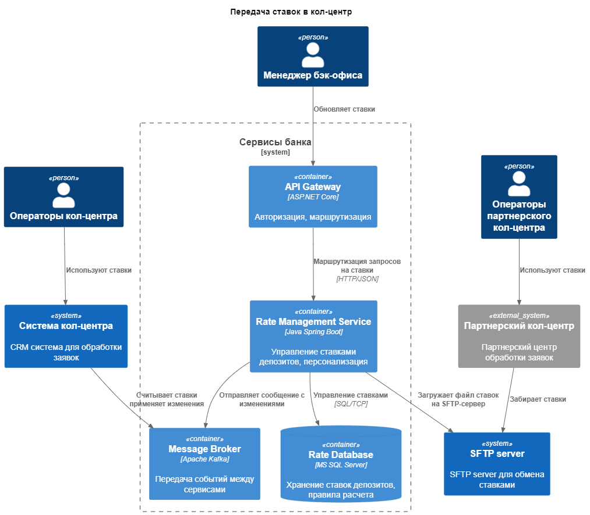

### **Название задачи:** Открытие депозитов
### **Автор:** Петров Е.В.
### **Дата:** 09.07.2025
### **Функциональные требования**
Опишите здесь верхнеуровневые Use Cases. Их нужно оформить в виде таблицы с пошаговым описанием:

|**№**|**Действующие лица или системы**|**Use Case**|**Описание**|
| :-: | :- | :- | :- |
|1|Внутренний кол-центр, Менеджер, Сервисы банка|Обмен ставками с внутренним кол-центром|1. Менеджер обновил ставки 2. Сервисы банка отправляет сообщение с изменениями в kafka 3. Внутренний кол-центр считывает ставки из кафки и применяет изменения|
|2|Партнерский кол-центр, Менеджер, Сервисы банка|Обмен ставками с партнерским кол-центром|1. Менеджер обновил ставки 2. Сервисы банка формирует файл со ставками 3. Сервисы банка загружает файл на SFTP-сервер 4. Партнерский кол-центр периодически забирает файл с SFTP-сервера 5. Партнерский кол-центр использует загруженный файл|

### **Нефункциональные требования**
Опишите здесь нефункциональные требования и архитектурно значимые требования.

|**№**|**Требование**|
| :-: | :- |
|1|Доступность сервисов SLA 99,9% (24/7)|
|2|Обязательное шифрование трафика (HTTPS/TLS)|
|3|Подключить к работе партнерский кол-центр|
|4|Партнерский кол-центр получает новые ставки по SFTP|

### **Решение**

Также опишите, какой логикой вы руководствовались в ходе принятия решений и выбора технологий. Не забывайте, что необходимо учесть все функциональные и нефункциональные требования.

Apache Kafka
- Удобное горизонтальное маштабирование сервисов
- Микросервисная архитектура
- Изоляция старых систем

Загрузка файлов из сервиса ставок
- Простая реальзация

### **Альтернативы**
Опишите здесь наиболее важные альтернативные решения.

Отправлять ставки через Email:

Плюсы:
- Простота реализации

Минусы:
- Ненадежность
- Несвоевременные обновления
- Человеческий фактор

**Недостатки, ограничения, риски**

Подробно опишите здесь недостатки, ограничения и риски выбранного решения.

SFTP-сервер:
- Ставки обновляются не в реальном времени
- клиенты могут получать устаревшую информацию
