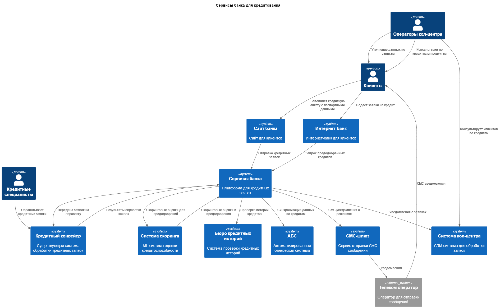
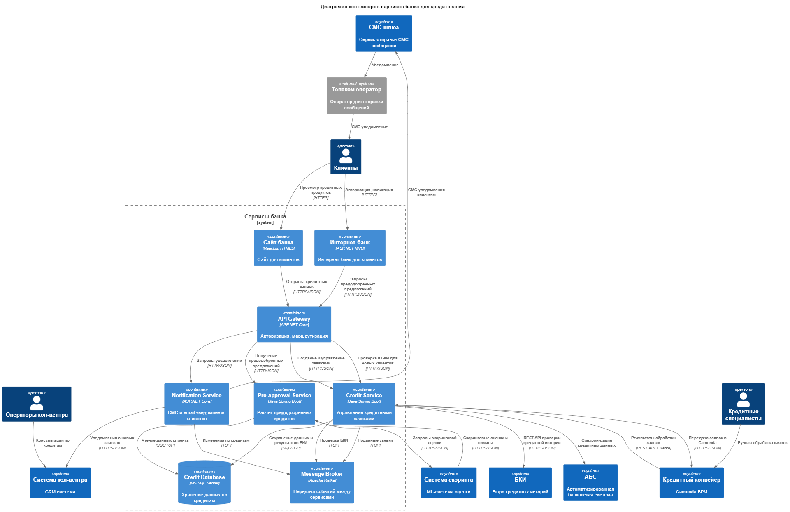

### **Название задачи:** Открытие депозитов
### **Автор:** Петров Е.В.
### **Дата:** 09.07.2025
### **Функциональные требования**
Опишите здесь верхнеуровневые Use Cases. Их нужно оформить в виде таблицы с пошаговым описанием:

|**№**|**Действующие лица или системы**|**Use Case**|**Описание**|
| :-: | :- | :- | :- |
|1|Клиент, Интернет-банк, Кредитный Сервис, Сервис предодобрения, Система скоринга|Предодобренные кредиты|1. Клиент авторизуется в интернет-банке 2. Система отображает предодобренные кредиты 3. Клиент заполняет анкету для кредита (сумма, срок, цель) 5. Система отправляет заявку в кредитный конвейер 6. Система скоринга оценивает заявку 7. Клиент получает решение в течение дня 8. После согласия клиента создание кредитного договора в АБС|
|2|Клиент, Сайт, Кредитный Сервис, Кредитный конвейер, Система кол-центра|Кредитная заявка с сайта|1. Клиент заполняет кредитную анкету на сайте 2. Система запрашивает согласие на проверку в БКИ 3. Кредитный Сервис проверяет клиента через БКИ 5. Система передает заявку в кредитный конвейер 6. Менеджер кол-центра связывается с клиентом для уточнений 7. Система скоринга оценивает заявку с данными БКИ 8. Клиент получает СМС и email уведомление о решении в течение дня|
|3|Кредитный Сервис, Кредитный конвейер, Система скоринга, Credit Notification Service|Автоматическая обработка кредитной заявки|1. Заявка поступает в кредитный конвейер 2. Система валидирует данные заявки 3. Система вызывает сервис скоринга 4. При высоком скоринге - автоматическое одобрение 5. При среднем скоринге - передача кредитному специалисту 6. При низком скоринге - автоматический отказ 7. Credit Notification Service отправляет СМС и email уведомление клиенту о решении|
|4|Сервис предодобрения, Система скоринга, АБС|Расчет предодобренных предложений|1. Сервис предодобрения запрашивает данные клиента из АБС 2. Система скоринга рассчитывает кредитоспособность 3. Формируются кредитные предложения дял пользователя 4. Предложения отображаются в интернет-банке|

### **Нефункциональные требования**
Опишите здесь нефункциональные требования и архитектурно значимые требования.

|**№**|**Требование**|
| :-: | :- |
|1|Время отклика пользовательского интерфейса < 100 мс|
|2|Доступность сервисов SLA 99,9% (24/7)|
|3|Поддержка до 1000 одновременных пользователей|
|4|Обязательное шифрование трафика (HTTPS/TLS)|
|5|Минимизация нагрузки на существующую систему скоринга|
|6|Использование текущего стека технологий (MS SQL, Oracle)|
|7|Микросервисная архитектура для депозитного функционала|
|8|Горизонтального масштабирования сервисов|
|9|Собирать логи для всех операций в системе|
|10|Автоматическое резервное копирование данных|
|11|Изоляция новых сервисов от критичных систем|
|12|Соответствие корпоративной системе дизайна|
|13|Асинхронная обработка событий через Kafka|
|14|Переиспользование существующего кредитного конвейера (Camunda BPM)|

### **Решение**
Приведите диаграммы контекста и контейнеров в модели C4. Опишите там основные компоненты и интеграции всех элементов решения. 

Также опишите, какой логикой вы руководствовались в ходе принятия решений и выбора технологий. Не забывайте, что необходимо учесть все функциональные и нефункциональные требования.

Решение полагается на использование текущих сервисов, кредитного конвейера и системы скоринга.
Использование знакомого стека технологий команде разработки.

Apache Kafka
- Разгрузить перегруженную систему АБС
- Удобное горизонтальное маштабирование сервисов
- Микросервисная архитектура
- Изоляция старых систем

API Gateway
- Сосушествование новых и старых элементов системы
- Обший мониторинг действий пользователя
- Вынесение общей логики авторизации

### **Альтернативы**
Опишите здесь наиболее важные альтернативные решения.

Использовать REST API вместо Брокера сообщений для передачи заявок а нагрузку снизить кешированием. 

Kafka добавляет сложность, а REST API проще для команды. Можно снизить нагрузку на АБС за счёт кеширования.

Плюсы:
- REST API самый распространенный стандарт
- Наличие опыта использование командой
- Прямые ответы без задержек

Минусы:
- Сложнее горизонтально маштабировать
- Возможна перегрузка системы и последовательный отказ сервисов

**Недостатки, ограничения, риски**

Подробно опишите здесь недостатки, ограничения и риски выбранного решения.

- Дополнительных инвестиций в инфраструктуру из за микросервисной архитектуры
- Дополнительные ресурсы для поддержки
- Увеличатся временные затраты на разработку изза нового стека технологий
